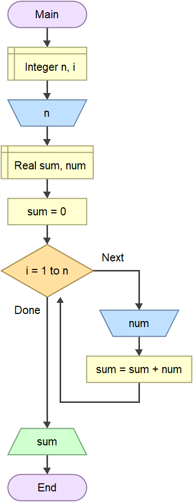

# **Збир унетих n реалних бројева**

## **Задатак**

Програм у програмском језику *C#* који, за унето `n`, узрачунава и исписује суму унетих `n` **реалних** бројева. 

## **Programski kod** 

```cs
unsing System;

namespace SumaUnetihBrojeva
{
  internal class Program
  {
      static void Main(string[] args)
      {
          int n = int.Parse(Console.ReadLine());
          double sum = 0;
          for(int i=1; i<=n; i++)
          {
              double sum = double.Parse(Console.ReadLine());
              sum +=num;
          }
          Console.WriteLine(sum);
      }  
  }
}
```


